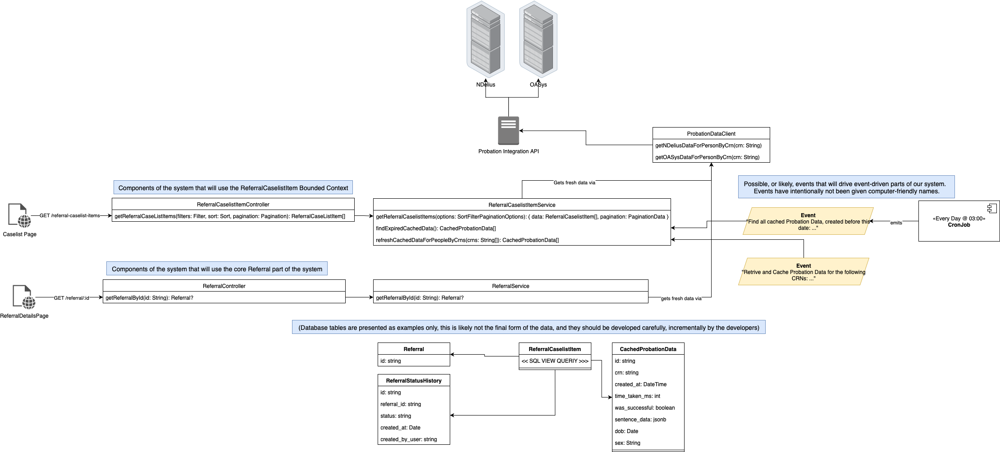

# Architecture: Referral Caselist Item

This document details the software development team's thinking about solving a software architecture problem related to the Caselist view in Accredited Programmes in Community.  It is somewhere between a JIRA (which are largely made to track work, and be disposed) and a Confluence page (which can detail decisions, but often get out-dated quickly).

It introduces the problem, and provides a high-level technical overview for what a solution might look like, and the pitfalls we need to avoid.

## The Problem Context

In the Custody setting, we have seen the Referral entity become a God Object[^godobject].  Having one entity contain so many use-cases has made the code hard to modify over the long-run, and has performance implications.  We are keen to keep the design of our data entities small in the Community setting.  Hopefully this will allow our codebase to become and remain easier to change, understand, test, and use.

The AcP Community dev team are building out the "Caselist" view as one of our first journeys.  A Caselist is a list of Referrals.  Initially these will be Referrals related to a given Probation Delivery Unit (PDU), but one could also imagine a Caselist for an individual Probation Officer, or of Referrals in a specific status.  

The PDU Caselist screen contains a table of Referrals, which is sortable, searchable, filterable, and paginated.  The information presented in the table is from both local and external sources:

- Local data: this is information that the Manage & Deliver itself is concerned with, e.g. Availability or Probation Office.  Users, or possibly the system, will be able to read and modify this data entirely within the M&D web platform.
- External data: information stored outside our service's bounds.  Primarily this is data from NDelius (e.g. a Person's name and date of birth) or OASys (e.g. their risk).  This data might be readable by our users from the web service, and possibly even editable, but the data is ultimately stored outside of our system.

These functional requirements introduce non-trivial technical complexity that would make it easy to stumble into another God Object antipattern, as well as several other performance pitfalls.  

## Decision: Use a separate Bounded Context for the Caselist pages

We have decided that the Caselist page should not show a list of `Referral`s, such as are stored in the `referrals` table in oru database, but rather we will create a purpose-build aggregated data entity: `ReferralCaseListItem`.  

This will allow our software architecture to adhere to the Single Responsibility Principle[^spr], and build a performant, eventually consistent data structure to present.  In the parlance of Domain-Driven Design (DDD), the `ReferralCaselistItem` represents code allocated to a specific _Bounded Context_.  This approach recognises that having strongly centralised code can cause problems:

> In those younger days we were advised to build a unified model of the entire business, but DDD recognizes that we've learned that “total unification of the domain model for a large system will not be feasible or cost-effective”.  So instead DDD divides up a large system into Bounded Contexts, each of which can have a unified model - essentially a way of structuring MultipleCanonicalModels.[^boundedcontext]

That is, by recognising the difference between managing a `Referral` versus viewing the Caselist  pages, we are able to build the right tools for the problem at hand, e.g. status validation on the core `Referral` versus data filtering and sorting of the `ReferralCaselistItem`.  It means that components of our system can have fewer responsibilities, and can remain ignorant of other parts of the system.  These are well-established goals for codebase architecture.

For a more in-context example, Microsoft examine Bounded Contexts for an imagined drone delivery company [^msboundedcontext].

## tl;dr Architecture Diagram 

Each of the components of the above diagram will be explained in greater detail below.  

For context, I have provided the `.excalidraw` file from the initial architecture mobbing session on `./assets/ReferralCaselistIemBoundedContext.excalidraw` file.

## Decision: Use a managed database table, not a Materialised SQL view

We are therefore going to create a `ReferralCaselistItem` entity, and use that to populate the Caselist view.  The code for that entity can be found [in ReferralCaselistItemEntity.kt](../src/main/kotlin/uk/gov/justice/digital/hmpps/accreditedprogrammesmanageanddeliverapi/entity/ReferralCaselistItemEntity.kt)

We decided to store this data as a managed table (i.e. a table in postgres), and not a materialised SQL view[^materialisedview] because of the complexity and black-box nature of a materialsied view.  Additionally, team members have more experience with managed tables, making this a more familiar approach for the team members who will build and maintain the system.

We are concerned that this kind of manual SQL querying and management could make it difficult to migrate or change SQL structure at a future point.  They could also be difficult to test in a production-like environment, i.e. because so many services and repositories are presently mocked out in tests, we could break the implementation and not easily receive an automated alert. 

## Decision: Use events to trigger refreshes and rebuilds of the ReferralCaselistItem

With this decision, we need a set of strategies to keep the `ReferralCaselistItem` table up-to-date with the data it reflects on, both internally and externally.  E.g. when somebody updates the Status of a Referral, we need to make sure that as well as us creating a new entry in the `referral_status_history` table, the `referral_caselist_item.status` field is updated with the new field.

We should manage this in an event-driven way.  This will produce an eventually consistent system[^eventualconsistency], meaning that the `ReferralCaselistItem` may contain out-of-date data for the time between a change to external or internal data (e.g. the Status or Probation Office changes).  We consider this an acceptable trade-off because:

1. When loading the Referral Detail page we not load data from the `ReferralCaselistItem`, and instead will bring in direct data both internally (e.g. using the `ReferralStatusHistory` log), and externally (i.e. fresh NDelius, OASys) data.  Meaning that when the user is viewing the Referral in detail, they will _always_ see the most up-to-date information.
2. From speaking with product team members, it seems that having a small (e.g. minutes to hours) lag in updating the data shown in the Caselist table is aceptable by the users.  

Let's give an example.  Imagine that a user updates the status of a Referral in the Web UI.  When they do so, out API will emit an event to the HMPPS Domain Events queue to describe that, e.g. `accredited-programmes-community.referral-status.updated`.  Elsewhere in the code, we have a listener to that event, which receives the event, and handles it by finding the `ReferalCaselistItem` related to that `Referral`, and updating the `status` field.

## Decision: Cache data from external sources, and periodically check and refresh it.

We need a strategy for keeping the `ReferralCaselistItem` up to date with externally managed data.  Unlike the change of internal data, we cannot guarantee clean, easy to work with events associated with a single change.

To do so, we will create a cached layer, which will be a set of managed postgres table (and not e.g. a Redis instance, at least for now) which contains basic information about when our system received Probation Data (e.g. NDelius, OASys) for a person, as identified by their CRN.

There are three things that can cause this data to be initially fetched, shown in the Diagram below.  A user can view the Referral Details page, the Referral can be initially created by our system, or a scheduled job (i.e. a Cron Job) will periodically check for any cached data associated with non-closed Referral which hasn't been updated in a period of time, e.g. 3d.

Because of the need for Strong Consistency when loading the detail page (i.e. when a Referral Detail page is loaded, the data from NDelius and OASys is loaded immediately, and that fresh data is shwon to the user), there's two ways that we handle the refresh of a cache:

1. Our system regularly checks for stale caches, e.g. through a Cron Job, and emits an event that indicates a batch of CRNs need to have their Probation Data refreshed.  Batching the data like this will allow for better performance of our system, by reducing the overheads of emitting and processing an event.  Another part of our system listens for those events requesting a refresh, and does so.
2. A human user views a page which triggers a forced and synchronous refresh of data, i.e. the page will not load until the fresh data has been retrieved.  We may as wel use this as a chance to refresh the cache.

Let's take a look at what happens when a Referral Details page is loaded: 

And a similar diagram for the automated process:

[^godobject]: https://en.wikipedia.org/wiki/God_object
[^srp]: https://en.wikipedia.org/wiki/Single-responsibility_principle
[^boundedcontext]: https://martinfowler.com/bliki/BoundedContext.html
[^msboundedcontext]: https://learn.microsoft.com/en-us/azure/architecture/microservices/model/domain-analysis#define-bounded-contexts
[^materialisedview]: https://www.geeksforgeeks.org/dbms/differences-between-views-and-materialized-views-in-sql/
[^eventualconsistency]: https://www.baeldung.com/cs/eventual-consistency-vs-strong-eventual-consistency-vs-strong-consistency

