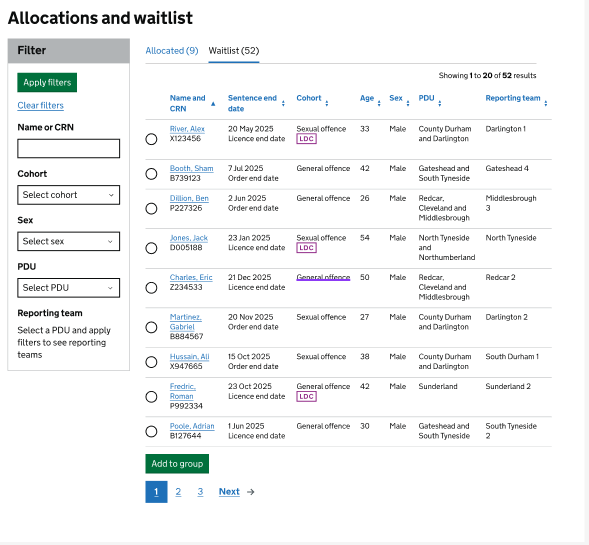

# Architecture: Group Waitlist Item

For the group allocation screens in the UI we need to be able to display a relevant list of fields about a person in
order to allocate them to the correct group. This list of referrals has to be sortable and filterable as shown in the
image below.

# Implementation options

As the fields being displayed are similar to the information displayed in the `referral_caselist_item_view` there are 2
options:

1. Re-use the same view `referral_caselist_item_view` and add the additional fields needed for the new UI page
2. Create an entirely new view `group_wait_list_item_view`

# Decision

Option 2 was chosen as this allows us to add useful filterable fields such as
`active_programme_group_id` to the new view where adding this field to the `referral_caselist_item_view` would not have
made sense in its context. By creating a new view we are able to separate the contexts of the 2 views and ensure that if
there are UI changes to either of these
pages in the future then it should be fairly simple to adapt the views to meet those needs without affecting other areas
of the service.

This excalidraw document details the whole design for the group allocation pages, which includes the initial data
structure of the new view [excalidraw](assets/group_waitlist.excalidraw).