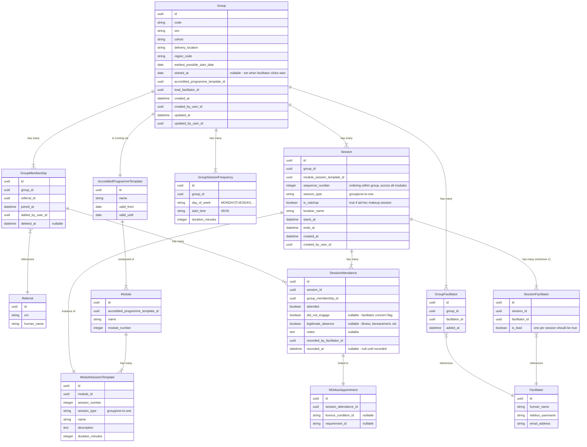

# Programme Template: A Tool for Creating Sessions in Accredited Programmes

> Last edited by Wilson on 2025-11-05

**tl;dr** This document proposes a data structure called the `ProgrammeTemplate` as a tool to allow our system to create Sessions (both Group and One-to-One) for a Group.  As a solution, it solves the core problems in a cohesive way, and facilitates future needs (e.g. rescheduling a session, recording attendance and engagement) 

## Glossary 

- **Individual Session**: A Session where there may be one or more facilitators, but there will only be one Person ono Probation attending.  For example: the pre-group one-to-one is an Individual Session, and so is the "three way" meeting.
- **Programme**: A structured curriculum delivered to Groups.  We will be working with the Better Choices (BC) Programme.
- **Module**: A group of cohesive, or thematically-related Sessions that a Person on Probation will need to complete as part of the Programme. 
- **Group**: A collection of People on Probation (via their Referrals) who will complete a single Programme synchronously together.  You can think of this like a temporary class of students.
- **Membership**: A Referral's participation in a specific group
- **Session**: An individual teaching event (group or one-to-one) that takes place at in a place, at a time, led by one or more Facilitator.
- **Referral**: A requirement (via Licence Condition or a Court Order) for a Person on Probation to complete a specified Programme.
- **Facilitator**: The member of MOJ staff member delivering session(s)

## Context and Background

This document examines a single slice of functionality of our service, not its entire lifecycle.  Broadly stated, we are building a service to support and facilitate individuals through planning, facilitating, and then doing some degree of reporting for a structured Programme with mixed delivery formats (i.e. Group and one-to-one sessions).   

For the purpose of this document please consider the bounds to be (keywords in **bold**): supporting **Treatment Managers** and **Facilitators** to **Schedule**, deliver, and report a **Person on Probation**'s engagement and **Attendance** with a **Programme** (initially the "_Building Choices_" Programme) to **Groups**

We are limiting ourselves exclusively to the Better Choices (BC) Programme.

## The Current state of Software

At time of writing our Service has awareness of the following entities:

A **Group** represents cohort progressing through a programme together.  A Group will complete a specific Programme (or version of a Programme).

> [!IMPORTANT]
> We have had to name this `programme_group` in the database, because the `group` keyword 

**Group Membership** is a way of joining a Referral to a Group.  In the real world, Group Membership needs to remain flexible (e.g. people can leave Groups; Group Composition can change before the Group starts).

## The Problems

Each Group of People on Probation that completes a Programme will have a structured, consistent set of Sessions to complete their Programme.  These Sessions are grouped into Modules.  

Some of these Sessions are "Group Sessions", i.e. many People on Probation will attend the same location at the same time, and some are "Individual Sessions", where people attend individually.  Group Sessions will involve attendees being in the same place at the same time, but the Individaul sessions will likely have to be staggered across a set period of time.  They will, by necessity, break out of the "blocks" or frequency set at the group level.  

Because these sessions are so highly structured (i.e. every cohort running the Building Choices programme will experience the same sessions in the same order, even if the frequency of sessions changes).  It is reasonable to expect a software system to automatically create a series of Sessions (both Group and Individual) to reduce the administrative burden of teams.

When the Facilitators have delivered all of the Sessions for a Group, we expect them to evidence an individual Person on Probation's completion of the Programme.  This means, broadly, that the Person on Probation has attended every session (or has "made up" any missed Sessions), and they have engaged with the Programme.  We therefore need to be able to first record, and then roll-up or aggregate, some notion of an individual's attendance or engagement with individual Sessions.  

This data will not just inform an individual's progression, but could also (theoretically, and speculatively) give an indication of a Group's current position and progress, as well as providing reporting (e.g. across geography, sex, offence type).

## A Proposed Solution 

> [!NOTE]
> See the [Entity Diagram](#entity-diagram) section for a visualisation of this solution

It is helpful to consider the proposed solution in two halves:

1. How will our system know what Sessions to create, and what type they are?  I propose the **Accredited Programme Template** as a solution to this.
2. How will our system _actually_ create Sessions?  I propose the **Session** and **Session Attendance** entities to solve this problem.

### The Accredited Programme Template 

The core of the solution is the **Accredited Programme Template**.  This entity contains the definition of a Programme at a point in time.  A lot of things flow downstream from the **Accredited Programme Template**, but it rarely changes.  Many **Groups** will reference the same Template.

The Template contains an awareness of time (`valid_from`) so that the programme can evolve over time in a way that won't affect existing Groups, or Groups scheduled to start before a new policy/syllabus changes the structure of future groups.

The **Accredited Programme Template** contains many **Modules** which are logical groupings of themes of ideas covered in the Programme.  **Modules** are sequenced (i.e. Module 1 _must_ be completed before Module 2).

A **Module** is broken down into a series of Sessions through the **Module Session Template** which defines the required sessions within a module.  This is the "blueprint" for actual sessions that People on Probation in a specific **Group** will complete.  It specifies the Session type (group or one-to-one)
    
### Creating Sessions

A **Session** represents the actual scheduled teaching event.  A Session is like an event on a calendar: it represents a thing that is happening at a time, in a place, with attendees.  A Session must have at least one **Facilitator** (can have multiple).  A single Session can be for a group (all members of a **Group**) or One-to-One (i.e. one **Session** per Group Member)
    
Not every **Session** is a "scheduled session", i.e. one created by the **Accredited programme Template** - there is a need for our system to acknowledge ad-hoc and catch-up Sessions.
    
Our users will interact with Sessions in a lot of ways.  They will have to be able to reschedule a single session operations, perform "_Cascading Edits_" (i.e. update one Session and "push" every Session after it one "slot" into the future).

It is apparent that the **Session** entity represents a lot of things, and can be the subject to a lot of user interactions.

I therefore propose that we draw a boundary around the **Session** at the point at which we record information about what actually happened (not just what is _planned_ to happen).  The **Session Attendance** entity contains the complexity of recording a **Person on Probation's** attendance, engagement, and participation in an individual **Session**.

To do so, we will store one record per member per **Session** (including Group Sessions).  At time of writing, the notion of "attendance" is not a simple binary.  For example, we may wish to capture the arrival/departure times for partial attendance, rich text notes about their engagement, or any other set of arbitrary questions (answered by facilitators).
    
The current model would see **Session Attendance** entities as the container for "perfect" attendance, engagement concerns, and legitimate absences.
    
This will be the smallest atom from which we can derive or roll-up completion, attendance, or engagement metrics for an individual at the **Group** level.

## External APIs

### nDelius Appointments API

An obvious, high-value add from our system is the ability to add **Appointments** to the profile for a **Person on Probation**.  This takes a lot of burden from Probation Practitioners to either double-key or check information in an external system.

The Probation Integration Team have been excellent to us, and have provided an Appointments API which will allow us to create, delete, and search for Appointments in nDelius.  Our system will maintain a very thin caching layer between our service and nDelius for ease for finding entities, and to help us recover from incomplete or failed transactions.

### Bank Holiday API

We need an awareness of UK Bank Holidays so avoid scheduling **Group** or one-to-one **Sessions** on them.  

For this we can use the UK Gov's [Bank Holiday API](https://www.api.gov.uk/gds/bank-holidays/#bank-holidays)

## Entity Diagram

## Key Inteactions

### Scheduling Requirements

- **In Scope**: Generate all Group and One-to-One Sessions for a Group
    - Follow programme template sequence
    - Must skip bank holidays (via external API)
    - Generated at group start time
- **In Scope**: Cascade Rescheduling: the ability to defer a single session and adjust all subsequent sessions
    - Operates on group frequency pattern
    - Affects only sessions scheduled at or after the postponed session
- **In Scope**: Catch-Up Sessions: when a **Member** misses **Session** but stays in the **Group**.
    - Must be trackable for completion and auditing purposes
- **In Scope**: Bus Stopping: Somebody can leave a Group, and within 12 weeks join a Group doing the same Programme, at the same point they got to in their previous group.

### Attendance and Completion Tracking
 
- **In Scope:** Attendance Recording - **Facilitators** record attendance per individual per **Session**
    - Use of mixed data (timestamps, checkboxes, rich text)
- **In Scope:** Derived Session and Programme completion
    - Module completion: all sessions in module completed
    - Programme completion: all modules completed
    - Must account for catch-up sessions as valid completions
    - Challenge: performance of aggregation across potentially large datasets

## Facilitator Management
 
- **In Scope:** Assign Facilitators and Cover Facilitators to a Group
    - We may need to specify between _Lead Facilitator_ and _Cover facilitators_ at Group creation.  This may need to change after creation or the start date.
- **In Scope:** Session-Level Assignment of Facilitators: who is running which Sessions (including one-to-ones)
- **Out of scope:** Facilitator schedule/calendar management.

## Open Questions

The following questions / issues are being addressed by active Product, Design, and User Research work.  In the interest of avoiding speculative design, I haven't accounted for all of these in the system design - however it is unlikely (but possible) that any of these questions will require a substantive change to the system design. 

- **Resilient and Recoverable long-running API integrations.** We need a resilient and resumable pathway to "Cascade Editing" or long-running operations, in case they get interrupted half-way through.  Especially for nDelius/external API operations.
- **Cascade Rescheduling Specifics.** The exact mode and specifics of a Cascading rescheduling will need to be decided.  E.g. if it will be manually or automatically triggered,  and how Group vs. one-to-one Sessions affect a Group's schedule.
- **Auditing and Logging in nDelius.**  If our system automatically creates (and tidies up) entities in nDelius, is there a need to leave some kind of record there (e.g. "John Doe was scheduled to attend Sessions 10-20 in 2025, but was removed from the Group de to X").
- **Stored Data Aggregation.** Do we want to store some kind of data aggregation for Programme Completion for e.g. a Person on Probation, or a Group?  Storing this information for the Group will make the bus-stopping journey easier (e.g. to find a Group running the same Programme, at the same Module)
- **Regional Variation.**A lthough protocol and procedure around the Building Choices Programme is defined by the handbook, we have previously seen that Regions an vary in their specifics.  We should be prepared requirements to vary by geographical Region, even if we don't accommodate these in Minimal Viable Product (MVP) delivery.
- **Reporting and analytics requirements.**  We have not yet dug into the technical specifics of reporting and analytics.  This includes internal (e.g. monitoring and alerting), and external (e.g. data estate reporting) processes. 

## Decisions we need to make

The following is an (incomplete) list of smaller-scale decisions that we have to make about the implementation:

- At what point do we create the **Sessions** for a **Person on Probation**?  When they are added to the Group?  when the Group starts?
- Should we allow for multiple catch-up attempts for same missed Session?
- Are there any caveats around pre-assigning Facilitators to generated one-to-one sessions
