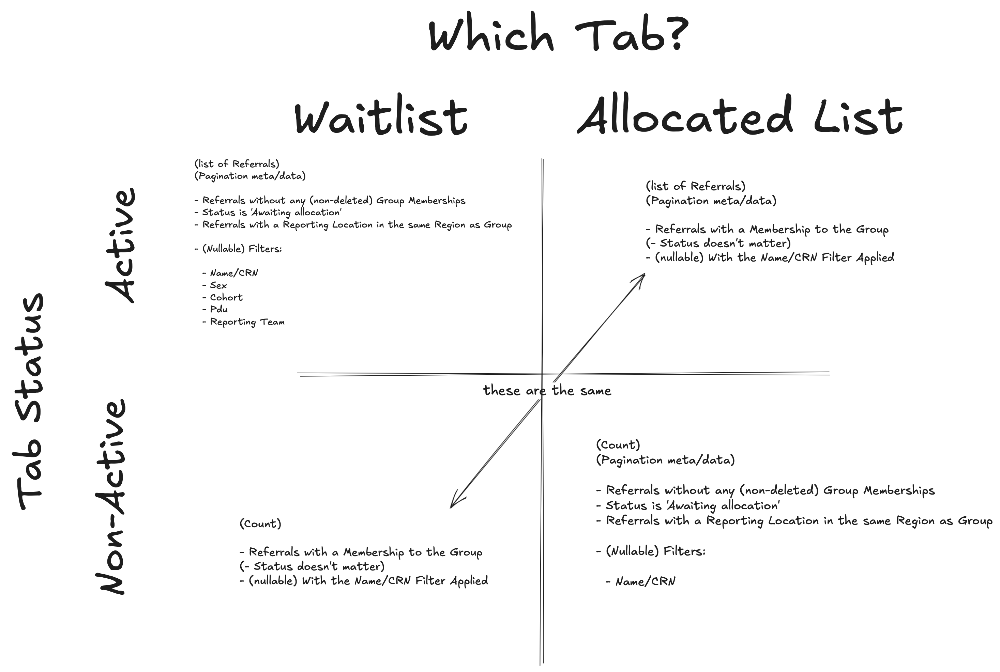

# Group Details Page Tab

When viewing a group, you view the Group Details screen. 

There are two possible "Tabs" to select on this page: the WAITLIST tab, and the ALLOCATED tab.  The user must have one of these two tabs selected.

- **WAITLIST** shows all possibly viable Referrals that _could_ be assigned to a Group, but have not.
- **ALLOCATED** shows all Referrals which _have_ been added to the Group.

The WAITLIST tab shows a series of filters, but the ALLOCATED tab shows _only_ a single textbox to filter by Name/CRN.

The Referrals on both screens are paginated, and you can see a count of Referals in the non-Active tab in the UI.  This count should consider _only_ the Name/CRN filter (e.g. it should not filter by cohort or sex) 

The UI shows the user the count of Referrals available in the other (i.e. non-active) Tab

## Filtering Data

The logic involved in selecting which Referrals to show is non-trivial.

A Referral is in the WAITLIST if:

- It does not have any active/non-deleted GroupMemberships for any Group.
- It is in the `Awaiting Allocation` Status
- Its ReportingLocation is in the same Region as the Group
  - The Group's Region is taken from the first Team of the User who created the Group initially.

A Referral is in the ALLOCATED list if:

- There is one non-delete GroupMembership linking the Referral to the Group.

## Data Flow

In order to provide all the data necessary for the Group Detail screen, the code touches a variety of data sources, and has to make decisions based on the current Active/Non-Active tab combination of WAITLIST or ALLOCATED list.

One of the sources of the complexity is the fact that the WAITLIST has a variety of filters, and the ALLOCATED list shows only the Name/CRN filters.  Non-relevant filters should not be shared across the different tabs (e.g. the ALLOCATED list should not filter results based on sex or cohort).

Another source of complexity is the need to only present Reporting Teams and PDUs which are present in the data being returned; and also to only return Reporting Teams if a PDU is selected.

## Filters

The API is responsible for passing the UI the complete list of possible values for all Select/dropdown components.  E.g. a list of PDUs or Reporting Teams.

In order to generate this data, the API needs an awareness of the Filters being passed in, as well as a set of static enums (e.g. to get a list of possible sexes or cohorts).