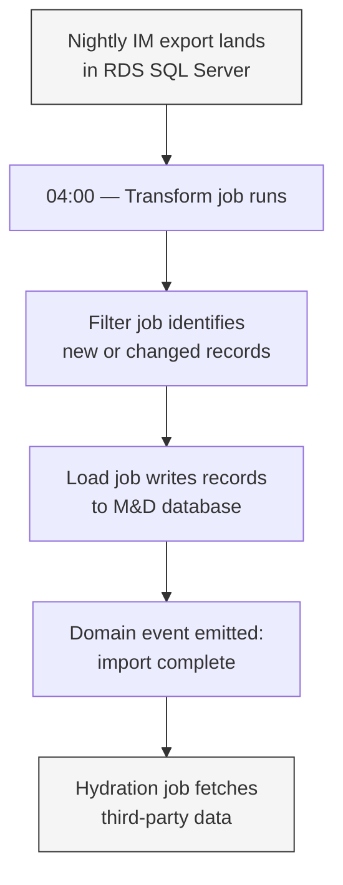
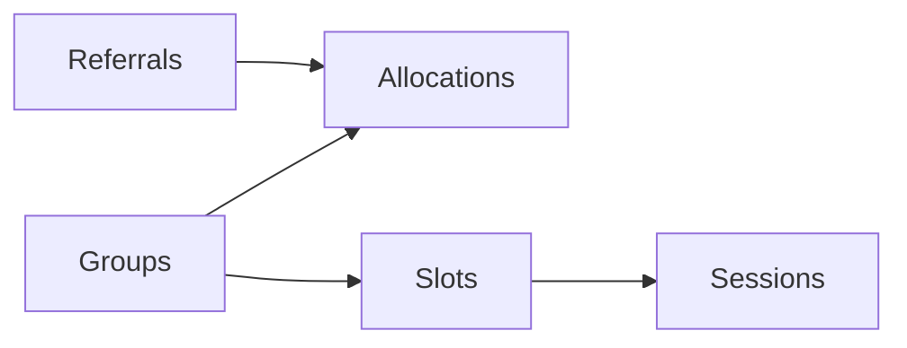
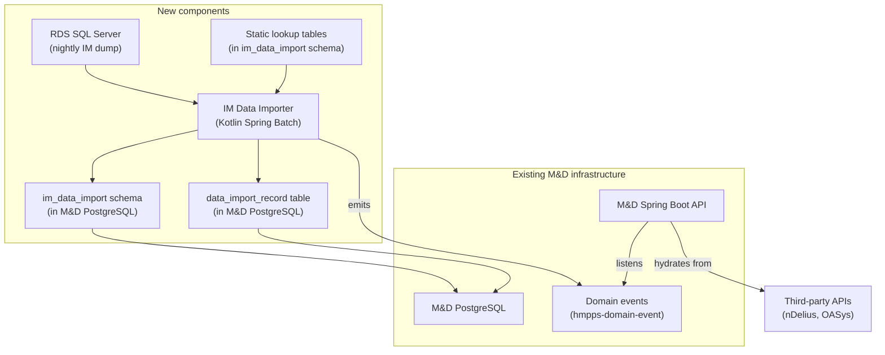

# Loading Legacy IM Data into M&D

> Status: Draft document, not ready for comments or review.  Last reviewed 2026-02-11 by TJWC.

**tl;dr**  I think we should deploy a new Spring Boot Kotlin Service using the Spring Batch framework to describe and orchestrate data loading of IM data into M&D.  I think this is a pragmatic choice for the team as it exists currently, and is likely to exist for the rest of 2026.

## What is this document?

It presents a proposed architecture for importing data from the legacy Interventions Manager (IM) system into the M&D service.  It covers the problem we need to solve, the solution we are proposing, the alternatives we considered, and the next steps required to begin implementation.

## Who is this for?

The intended audience is the M&D development team.  It assumes familiarity with our existing architecture and infrastructure, but does not assume any prior knowledge of IM's data model or how data reaches us from that system.

## Context

M&D is replacing IM as the system used by frontline staff to manage Referrals to Accredited Programmes in Community.  This service exists entirely to fulfil that purpose.

The switch over from IM to M&D will happen incrementally over the coming months (Q1-2 2026), with a private beta period scheduled by the team.  During the rollout period, some staff will be using M&D while others remain on IM.  A given Referral or Group will only ever be actively managed in one system at a time; there is no period of dual-entry.  We hope that there will be no reverting from M&D _back_ to IM for any staff members.

As part of this rollout, we need to import data from IM into M&D so that staff switching to the new system can see their referrals, groups, and associated records from day one.  This is not a one-off migration — it must run nightly for the duration of the rollout, keeping M&D up to date with changes made in IM by staff who have not yet migrated.

There are several noteworthy technical specifics to our context:

- **Full SQL dumps.**  We cannot (easily) receive incremental change sets from IM.  Instead, we receive a full nightly export of the IM database as a SQL Server (2019 version) backup.  We must determine what has changed ourselves.
- **Different data models.**  The entity shapes in IM are substantially different from those in M&D.  A straightforward database-to-database migration is not possible; the data must be transformed as part of the import.
- **Data quality.**  The incoming data varies in quality and completeness.  Some fields we need in M&D do not exist in IM and must be sourced from elsewhere.  This is due to both the particularities of IM and the complexity of the Justice system and how it changes over time.
- **nDelius hydration.**  All Referrals in M&D need an associated enrichment or hydration from nDelius data (e.g. risks, personal information).

## The specific problem

We need to alter our system such that it can:

1. Take a nightly SQL Server database dump from IM.
2. Transform the relevant entities from IM's data model into a shape compatible with M&D.
3. Identify which records are new or have changed since the last import.
4. Load those records into the M&D PostgreSQL database without overwriting data that has been modified in M&D itself.
5. Trigger downstream hydration of records.

And do so in a reliable, monitorable, and performant way.

This pipeline must be running before our private beta so that we can conduct pre-beta testing with real data.  It must also be reliable enough to run unattended overnight, with clear visibility into what was imported, what was skipped, and what failed.

Beyond the core flow, there are enough edge cases (e.g. static data joins, idempotent upserts, change detection against a full dump, ordered loading of dependent entities) that the transformation and loading logic benefits from being expressed in a general-purpose programming language rather than a purely declarative query language or ETL tool.

## Proposed solution: Kotlin with Spring Batch

I propose building the import pipeline as a Kotlin application using the Spring Batch framework, deployed as a scheduled job within our existing Kubernetes infrastructure.

### Why Spring Batch

The M&D team's primary expertise is in Kotlin and Spring Boot.  Spring Batch is a mature framework within the Spring ecosystem designed for exactly this class of problem — batch processing of large volumes of records with built-in support for job sequencing, retry, skip logic, and job execution metadata.  Other teams within the wider organisation have used Spring Batch for similar data import work.

The key advantages over alternatives are:

- **Team accessibility.**  Every developer on the team can read, write, test, and debug Kotlin code in their existing IDE.  There is no new language or runtime to learn.
- **Local development and CI.**  The pipeline can be run and tested locally without simulating a managed cloud service.  Unit and integration tests follow the same patterns the team already uses.
- **Debugging experience.**  When the pipeline fails — and it will — the on-call developer will be looking at a stack trace in a language they understand, not PySpark logs in CloudWatch.
- **Shared domain models.**  By extracting M&D's Jakarta ORM entity classes into a shared library (published via GitHub Packages), both the API and the import pipeline can use the same domain model, reducing duplication and drift.

### Alternatives considered

**AWS Glue** is Amazon's managed ETL service and was the most promising alternative.  It offers built-in support for connecting to multiple data sources, schema inference, and job scheduling.  Other teams in the organisation have used it successfully.  However, Glue jobs are written in PySpark or Python, neither of which the team has production experience with.  The local development and testing story for Glue is significantly weaker — jobs must either be tested against the Glue service itself or via a local Docker-based simulator that does not fully replicate the managed environment.  Given that this pipeline is not a big-data problem (we are dealing with tens of thousands of records, not billions), the distributed processing capabilities of Glue are unnecessary overhead.

**AWS Step Functions** orchestrating Lambda functions was also considered.  This would give good visibility into pipeline stages and built-in retry logic, but would require the transformation and loading logic to be split across multiple Lambda functions with tight execution time constraints, adding complexity without clear benefit.  Step Functions remain a possibility as an orchestration layer on top of the Spring Batch jobs if the need arises, but we do not believe it is necessary at this stage.

**A custom Kotlin application without Spring Batch** would avoid the framework's boilerplate but would require us to build our own job sequencing, retry logic, and execution metadata tracking — all of which Spring Batch provides out of the box.

Given the team's skill set, the bounded lifespan of the pipeline (it runs for the duration of the national rollout, not indefinitely), and the data volumes involved, Spring Batch strikes the right balance between capability and accessibility.

## How it works

The pipeline runs as a series of sequential stages, each with a clear responsibility.  The following diagram shows the high-level flow:

### Stage 1: Transform

The nightly IM database export is loaded into an RDS-hosted SQL Server instance in our AWS account.  This happens before the pipeline runs and is managed separately.

At a scheduled time (e.g. 04:00), the Transform job connects to both the SQL Server instance and the M&D PostgreSQL database.  It executes a series of SQL queries that read from the IM source tables and write transformed results into a dedicated schema in PostgreSQL (e.g. `im_data_import`).  These queries reduce IM's wide tables (120+ columns in some cases) down to the ~12–15 fields relevant to each M&D entity, performing any necessary renaming, type conversion, and restructuring in the process.

The transformation SQL is defined in version-controlled `.sql` files.  Because these queries necessarily reveal the structure of the IM database, they are stored in a private repository, separate from the main M&D codebase.

### Stage 2: Filter

The Filter job reads the transformed data from the `im_data_import` schema and determines which records need to be loaded into M&D.  A record is selected for loading if:

- It has never been imported before (i.e. no corresponding entry exists in the import log), OR
- Its source `updatedAt` timestamp is more recent than the last import run, AND its M&D-side `updatedAt` timestamp is older than the last import run (meaning the source has changed but no one in M&D has modified it).

Records where the M&D-side timestamp is newer than the last import are skipped — this is the mechanism that prevents stale IM data from overwriting changes made by staff already using M&D.

This logic is the single most important piece of correctness in the pipeline and must be specified precisely with worked examples before implementation.

### Stage 3: Load

The Load job takes the filtered records and writes them into the M&D production tables.  Entity loading must respect dependencies — for example, a group allocation cannot be created until both the referral and the group it references have been imported.

Each top-level entity and its dependents are loaded within a single database transaction (e.g. one transaction per group with its slots and allocations).  This means a failure loading one group does not prevent other groups from being imported, and failed imports can be retried individually.

The Load job also writes to an import log table (`data_import_record`) which records the mapping between source IDs and M&D IDs, the timestamp of import, and the outcome.  This log serves as both an audit trail and the input to the next run's Filter stage.

### Stage 4: Hydrate

After the core import completes, a domain event is emitted.  The M&D API listens for this event and triggers a hydration process that fetches supplementary data from third-party systems (e.g. nDelius, OASys).  This uses a queueing mechanism to avoid overwhelming those systems with concurrent requests.

The hydration step is deliberately decoupled from the core import.  If a third-party system is slow or unavailable, the core referral and group data is still present in M&D.  The M&D UI already handles the case where hydration data has not yet arrived, by triggering a fetch on demand when a user views a page that requires it.

### The import log

The `data_import_record` table is a central component of the pipeline.  It records:

- The entity type (e.g. Referral, Group).
- The source system ID.
- The corresponding M&D ID.
- The timestamp of import.

This table serves multiple purposes: it provides the ID mapping needed to link source records to their M&D counterparts, it enables the Filter job to determine what has already been imported, and it provides an audit trail of all import activity.

### Static data joins

For a subset of referrals (those created between specific dates), a field required by M&D — the Requirement ID — is not present in the IM data.  This data exists in a middleware system and will be provided as a one-off static export.  We will load this lookup data into a table in the `im_data_import` schema so that the Transform job can join against it.

This is a known gap that must be addressed before the affected referrals can be imported correctly.  The lookup data and the date boundaries must be confirmed and loaded ahead of the first production import run.

## New components and infrastructure

The following diagram shows how the new components relate to existing infrastructure:

The new components are:

- **RDS SQL Server instance** — hosts the nightly IM database dump.  Refreshed each night before the pipeline runs.
- **IM Data Importer service** — a Kotlin Spring Batch application, deployed as a Kubernetes CronJob.  Connects to both the SQL Server and PostgreSQL databases.  Lives in a private GitHub repository.
- **`im_data_import` schema** — a dedicated schema within the existing M&D PostgreSQL database, containing the transformed intermediate data, static lookup tables, and the import log.
- **Shared domain model library** — Jakarta ORM entity classes extracted from the M&D API into a standalone library, published via GitHub Packages, and consumed by both the API and the importer.

## Incremental delivery

This is a substantial piece of work, but it does not need to be built all at once.  The pipeline can be developed and deployed incrementally, one entity type at a time.

A sensible order of delivery would be:

1. **Infrastructure and skeleton.**  Stand up the private repository, the Spring Batch project, database connectivity to both RDS instances, the `im_data_import` schema, and the Kubernetes CronJob.  Verify that a job can run on schedule and connect to both databases.
2. **Referrals — transform and load.**  Implement the full pipeline for the Referral entity first, including the transform SQL, filter logic, loading, and import log.  Referrals are the most critical entity and will exercise all the core mechanisms.
3. **Groups, slots, and allocations.**  Add the remaining entity types, which will reuse the same pipeline infrastructure but introduce the entity-dependency ordering in the Load step.
4. **Static data join.**  Load the Requirement ID lookup table and integrate it into the Referral transform.
5. **Hydration integration.**  Wire up the domain event emission and confirm the M&D API's hydration process works against imported data.
6. **Monitoring and alerting.**  Instrument the pipeline with visibility into job outcomes — records imported, records skipped, records failed — and alerting for failures that require human attention.

Each of these steps can be tested independently against real IM data in a non-production environment.  The goal is to have the Referral pipeline running end-to-end as early as possible, so that we can validate the approach with real data well before the private beta.

## What if this approach is not agreed

If the team or wider technical leadership does not consider this architecture to be the right way forward, we would need to return to evaluating alternatives — most likely AWS Glue or a more bespoke solution.  This would reset the timeline and require the team to invest in learning a new technology stack before implementation could begin.  Given the Q1-2 deadline for pre-beta testing, any significant change of direction at this stage carries real schedule risk.

That said, the architecture described here is a proposal, not a fait accompli.  If there are concerns about specific aspects — the use of a shared PostgreSQL database, the choice of Spring Batch, the filtering logic — those should be raised and discussed.  The goal is to arrive at an approach the team is confident in, not to foreclose discussion.

## Open questions and known gaps

- **Timestamp reliability.**  The filtering logic depends on IM's `updatedAt` timestamps being consistently populated and accurate.  This needs to be verified against the actual IM data.
- **Delete handling.**  The current design does not detect records that have been deleted in IM between nightly dumps.  This is deferred for now but may need to be addressed later in the rollout.
- **Requirement ID lookup boundaries.**  The exact date range for referrals missing the Requirement ID, and the static export from the middleware system, must be confirmed and delivered before those referrals can be imported.
- **Monitoring tooling.**  The specifics of how job outcomes are surfaced to the team (dashboards, Slack alerts, etc.) have not yet been determined.