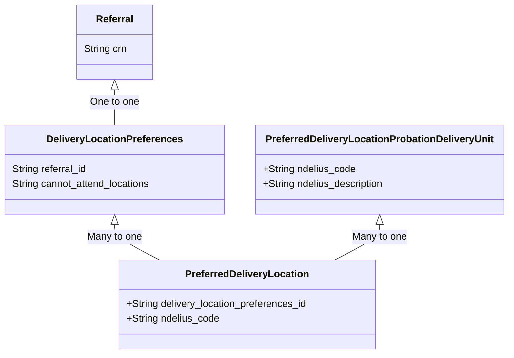

# Creating the PreferredDeliveryLocations and PreferredDeliveryLocationProbationDeliveryUnit

> [!NOTE]
> Last updated by Wilson 2025-09-09.  Ryan F and Jack D were involved in the decision making and will have context.

## Summary 

The migration file `V21__update_delivery_location_preferences_table.sql` created the tables necessary to persist two entities:

1. [PreferredDeliveryLocation](../../src/main/kotlin/uk/gov/justice/digital/hmpps/accreditedprogrammesmanageanddeliverapi/entity/PreferredDeliveryLocation.kt)
2. [PreferredDeliveryLocationProbationDeliveryUnit](../../src/main/kotlin/uk/gov/justice/digital/hmpps/accreditedprogrammesmanageanddeliverapi/entity/PreferredDeliveryLocationProbationDeliveryUnit.kt)

These represent, respectively, a geographic/physical location (e.g. an Office) where an Accredited Programme can take place; and the Probation Delivery Unit (PDU) that location falls within. 

These data models are essential to the planning of groups, as delivery of an Accredited Programme in an area that is accessible to a Person on Probation is a key part of te workflow.

## Relationships 

