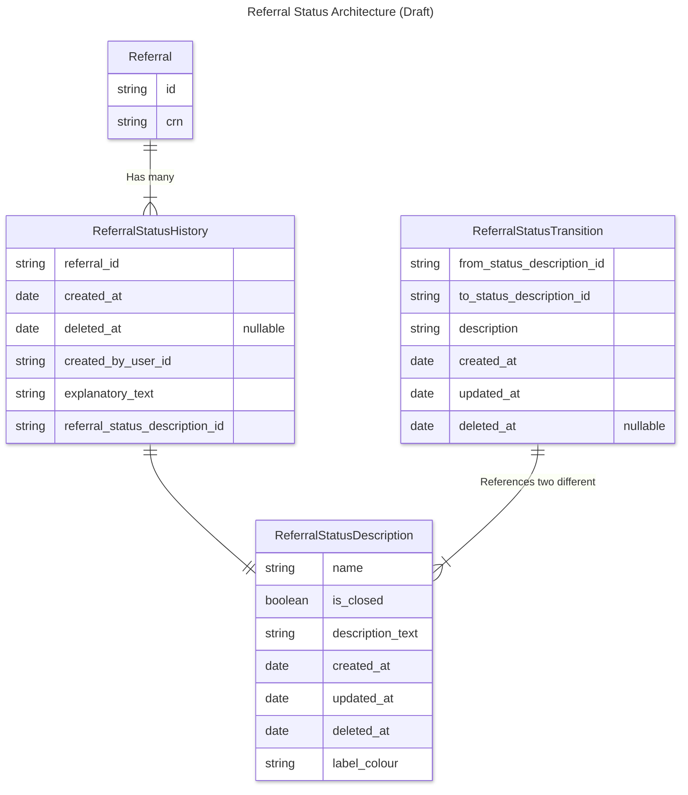

# Referral Statuses  

## tl;dr

Referral Statuses are modelled in our system as an event log, in the `referral_status_history` table.

Possible Referral Statuses are stored as reference data in the `referral_status_description` table.  

Descriptions of the possible transitions of a Referral's status (i.e. given a Referral's current status, what other Status(es) can a human user transition a Referral to?) are modelled in the `referral_transition` table.  

Both `referral_status_description` and `referral_status_transition` should be considered reference data - i.e. they should only be edited by developers/maintainers of the system.  In their current format, they are not designed for wider updating.  These tables include metadata fields (`updated_at`, `deleted_at`) to aid human debugging of the system, and to better surface changes to the system.

## Entity Relationship Diagram


```
```

## Referral Status History 

Every time the Referral's status is updated we create a new row in the `referral_status_history` table.  The "current status" of a Referral can therefore be considered the Status identified in the most recent entry in the `referral_status_history` table.

The `referral_status_history` table should be considered an append-only list of historical events.  You should not modify rows of this table, but instead create a new row.

It is incredibly important that whenever a Referral is created, a corresponding ReferralStatusHistory entity is also created.  

We have chosen _not_ to include a `deleted_at` column on this table because that adds complexity, i.e. we would need to consider what happens when there are < or > 1 rows without a `deleted_at` value.  Additionally, any create/append actions to the table would need to both create a new row _and_ update the existing rows.

## Referral Status Description 

The Referral Status Description entity represents a description of a possible Status that a Referral can be in.  

This data is stored in the `referral_status_description` table.  

This is necessary because Referral Statuses are finite and standard, i.e. they are not free-text input from the user.

Centralising this data into the database was done for consistency, but it could just as easily have been managed with in-code data structures.  

We have designed this table initially so that it should only ever be updated with SQL migration scripts by the developers / maintainers of the system.  Users of the M&D Community system (e.g. Training Managers) should not need access to this data.

At time of design, this data is consistent, i.e. there are no variations by geography, Accredited Programme, or cohort demographic (e.g. sex, learning needs).


## Referral Status Transition

A Referral cannot be transitioned _from_ any Status _to_ any Status.  Remember: possible Statuses are defined by a Referral Status Description.

The `referral_status_transition` stores information about:

1. The possible Statuses that a Referral can be transitioned `from` and `to`
2. Human- or UI-friendly information for displaying the transition, e.g.t he `help_text`

This data was designed to help provide users with opinionated and informed User Interfaces, where the only Statuses they are presented with when they go to update the Status of a Referral, are a list of valid (determined by the business) statuses.

This is Reference Data, and subject to the same considerations as Referral Status Descriptions: editable only by developers/maintainers of the system, globally constant.

